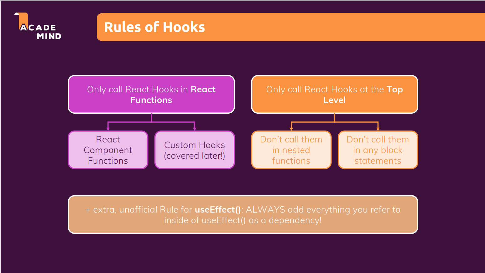

# [React course](https://www.udemy.com/course/react-the-complete-guide-incl-redux/learn/lecture/25595340#overview)

- [React course](#react-course)
  - [Section 1: Getting started](#section-1-getting-started)
  - [Section 2: Javascript Refresher](#section-2-javascript-refresher)
  - [Section 3: React Basics \& Working With Components](#section-3-react-basics--working-with-components)
  - [Section 4: React State \& Working with events](#section-4-react-state--working-with-events)
  - [Section 5: Renderig Lists \& Conditional Content](#section-5-renderig-lists--conditional-content)
  - [Section 6: Styling React Components](#section-6-styling-react-components)
  - [Section 7: Debugging React Apps](#section-7-debugging-react-apps)
  - [Section 8: Time to Practice: A Complete Practice Project](#section-8-time-to-practice-a-complete-practice-project)
  - [Section 9: Diving Deeper: Working with Fragments, Portals \& "Refs"](#section-9-diving-deeper-working-with-fragments-portals--refs)
  - [Section 10: Advanced - Handling Side Effects, usind Reducers \& Using the Context API](#section-10-advanced---handling-side-effects-usind-reducers--using-the-context-api)
  - [Section 11: Practice Project: Building a Food Order App](#section-11-practice-project-building-a-food-order-app)

## Section 1: Getting started

- It's a Javascript library used to build client-side applications
- It makes building modern and rich interfaces easier, we do it in a declarative way instead of imperative

## Section 2: Javascript Refresher

- Use "let" if you want to create a variable:
  ```javascript
  let prop = "hello";
  ```
- Use "const" if you want to create something that does not change:
  ```javascript
  const constantValue = "hello";
  ```
- Arrow functions awoids the issue with the "this" keyword
- Export & Imports

  ```javascript
  // person.js file
  const person = {
    name: "Marco"
  };
  export default person;

  // utility.js file
  export const clean = () => {...}
  export const baseData = 10;

  // app.js file
  /*
  * When there is an export with the "default" keyword I can
  * use the original name or rename it.
  */
  import person from "./person.js";
  import prs from "./person.js";

  /*
  * These are "name import".
  * Because we have not given any "default" we need to use
  * the curly branchets and specify what we are pointing to
  */
  import { baseData } from "./utility.js"
  import { clean } from "./utility.js"
  import { clean as cln} from "./utility.js"; // using an alias for clean
  import * as bundled from "./utility.js"; // Import all the named import and access them with bundled.*
  ```

- Classes, they are similar to what classes are in other languages:

  ```javascript
  // Definition
  class Person {
    name = "Marco"; // Property
    call = () => {...} // Method
  }

  const myPerson = new Person(); // Instantiation
  myPerson.call(); // Colling method
  console.log(myPerson.name); // Accessing property

  class Person extends Master; // Inheritance

  //////////////////////////////////////////////////
  class Human {
    constructor(){
      this.gender = "male"; // Property
    }
    printGender(){
      console.log(this.gender);
    }
  }

  class Person2 extends Human{
    constructor(){
      super(); // Mandatory if you inherit
      this.name = "Marco"; // Property
    }
    printMyName(){
      console.log(this.name);
    }
  }

  const person2 = new Person();
  person2.printMyName();
  person2.printGender();
  ```

- Classes, Properties & Methods, different syntax to achieve the same as before

  ```javascript
  // Class property definition
  // ES 6
  constructor(){
    this.myProperty = "value";
  }
  // ES 7
  myProperty = "value";

  // Class methods definition
  // ES 6
  myMethod(){...}

  // ES 7
  myMethod = () => {...} // No issues with the "this" keyword

  ///////////////////////////////////////////
  class Human {
    gender = "male"; // Property

    printGender = () => {
      console.log(this.gender); // I still need to use "this"
    }
  }

  class Person2 extends Human{
    this.name = "Marco"; // Property
    this.gender = "female"; // Updating super property

    printMyName = () => {
      console.log(this.name);
    }
  }

  const person2 = new Person();
  person2.printMyName();
  person2.printGender();
  ```

- Spread & Rest Operators:

  ```javascript
  // Spread operator (...) is used to split up array OR object properties
  const newArray = [...oldArray, 1, 2]; // created a new array from old + additionl values
  const newObject = { ...oldObject, newProp: 5 }; // Creates a new object with the old props plus the new one

  // Rest operator is used to merge a list of cuntion arguments into an array
  const filterArgs = (...args) => {
    // I get the parameters as array
    return args.filter((el) => el === 1); // filter considering value and type
  };

  console.log(filterArgs(1, 2, 3)); // prints [1]
  ```

- Destructuring:

  ```javascript
  // Allows you to extract array elements or object properties and store them in variables. Sounds like the spread operator.
  // Spread takes out all the elemets or props and distributes them in a new array or object
  // Destruct allows you to extract single elements or props to store them in a variable/s
  [a,b]=["Hello","Marco"];
  console.log(a); // Hello
  console.log(b); // Marco

  {name}={name:"Marco", age:123};
  console.log(name); // Marco
  console.log(age); // undefined
  ```

- Reference & Primitive types, they work similar to other languages

  ```javascript
  const number = 1; // Primitive
  const num2 = number; // Copy of the value

  const person = { // Referemce
    name = "Marco"
  }
  const person2 = person; // Reference copy
  ```

## Section 3: React Basics & Working With Components

- Why components:
  - Reusability, don't repeat yourself
  - Separation of concerns, don't do too many things in one and the same place (function)
- JSX stands for Javascript XML. At the end HTML is XML you can say
- A component in react is just a javascript function!!!
- Components **must** be defined with starting uppercase name. Thi because the react assumption is that "lower" case components are the built in html compenents, like "div", "p", "h2", while the one starting with upper case like "MyComponent" are the one we have defined
- Components **must** return one "root" element
- When you want to provide custom CSS code, the convention is to define the "CSS" file next to the component that it is going to use it, naming the file after the react component: "MyComponent.js", "MyComponent.css"
- In your custom component, react will make sure to pass only one parameter, the "props". You can call it whatever you want in your function definition, this object will contain all the properties passed to your function componenet
- props.children it is always provided automatically by react and it is set to the content between the opening and closing tag of my custom component

## Section 4: React State & Working with events

- It is not a mandatory convention to add a "handler" suffix to the functions which will handle the events, like the "click" event: const clickHandler = () => {...}
- React useState:
  - It registers the state for a specific component instance
  - When a state is changed, react will re-evaluate only that component instance
  - React keeps track of when we call the useState for the first time, so it will track the initial value and use it only the very first time we evaluate the function component
  - Whenever you update the state, and depende on the previous state you should call the "set state function" in this way:
    ```javascript
    setMyState((prevState) => {
      return { ...prevState, myProp: propValue };
    });
    ```
    we go for this approach because React schedules the set states. So if we have multiple set state and we depend on the previous state value, we this version of the set state we can be sure that React will always use the latest state available when processing our set state
- Lifting state up: it is when one component needs data generate in a different component in a different "component branch". To make these data available we have to "lift them up" to the closest "common parent component" which will then pass them dowm where needed

## Section 5: Renderig Lists & Conditional Content

- When rendering list react requires a "Key". This is needed because reacts uses that ID to understand what to update/add. If I don't specify the key, react will re-render the whole list again, which will reduce the performance and can lead to bugs because if it's re-creates the elements you might loose the saved state of the components
- Inline CSS can be added to an element using the "style" attribute, which accepts a js object as parameter. The key of the object is the CSS attribute name that you want to set, and the value is the value that you want to set. If you are trying to set a CSS property which has a "-" as separator, use the "camel case" syntax: "backgournd-color" -> backgroundColor

## Section 6: Styling React Components

- When I defined simple CSS files, the classes defined in these files are globally available, they are not scoped to a scpecific component/s
- [Styled components](https://styled-components.com/) it's a package that can help us to scope the CSS style to only certain components
  - I don't like this approach because I have to define the CSS inside the component file
- CSS Modules. React provides an alternative, CSS modules. I can continue to keep the CSS definition in a separate file, but I have to add the "module" word before the extension: "MyFile.module.css"

  - After that I can import this file in my component file "import styles from './MyFile.module.css'"
  - And use is in my component accessing the classes as jsobject properties

    ```javascript
    import styles from "./MyFile.module.css";

    <MyComponent className={styles.myclass} />;
    ```

## Section 7: Debugging React Apps

- [React development tools](https://chrome.google.com/webstore/detail/react-developer-tools/fmkadmapgofadopljbjfkapdkoienihi) is it a nice Google Chrome extension which add a couple of "tabs" in the devtool view, for example we will be able to navigate our components and inspect their properties

## Section 8: Time to Practice: A Complete Practice Project

- Just a recap of the modules until here

## Section 9: Diving Deeper: Working with Fragments, Portals & "Refs"

- JSX Limitations:

  - You cannot retunr more than one "root" JSX element
  - A workaround could be wrapping the JSX with a "div", but you might end up with a "<div> soup"
    ```html
    <div>
      <div>
        <div>
          <h2>Hi there</h2>
        </div>
      </div>
    </div>
    ```
  - A proper workaround could be to create a wrapper component

    ```javascript
    const Wrapper = props => {
      return props.children;
    }

    export default Wrapper;

    ...
    return(
      <Wrapper>
        ...
      </Wrapper>
    );

    ```

  - React already provides a default wrapper

    ```javascript
    return <React.Fragment>...</React.Fragment>;

    // OR
    return <>...</>;
    ```

- React Portals:

  - It helps writing HTML code which is semathically correct
  - To use portals you have to create an element in the main HTML, which will you link later in the component, so the comonent will be "portal" somewhere.
    Check [here](https://github.com/marcosolina/LearningReactJs/blob/main/Course/react_code/09-starting-project/public/index.html) and [here](https://github.com/marcosolina/LearningReactJs/blob/main/Course/react_code/09-starting-project/src/components/UI/ErrorModal/ErrorModal.js)

- References (Ref):

  - They allow us to access other DOM elements and work with them
  - It can be used for example when I have a form. In these cases I will usually use a "set state" function to update the state at every key stroke. With the usage of ref I can reference the DOM element and get the value when I need. Check [here](https://github.com/marcosolina/LearningReactJs/blob/main/Course/react_code/09-starting-project/src/components/Users/AddUser/AddUser.js)
  - **Rarely** use ref to directly manipulateing the DOM element

- Controlled vs Uncontrolled components:
  - When I access values using refs, the component becomes an "uncontrolled" component, that's because React does not controll anymore that component via direct access to the DOM element
  - It will be a Controlled component if I use the "useState" to read and set the values of the input element
  -

## Section 10: Advanced - Handling Side Effects, usind Reducers & Using the Context API

- Effect or Side Effect:

  - The main job of react library has the job to render the UI and react to user input
    - We want to evaluate & render JSX
    - Manage state & props
    - React to (User) Events & Input
    - Re-evaluate Component upon State & Prop changes
    - This is all "baked into" React via the "tools" and features covered in the course (i.e. useState() Hook, Proprs etc)
  - Side effects are anything else that might happen in the react app, for example:
    - Store data in Browser Storage
    - Send HTTP request
    - Set & Manager Timers
  - These task **must happen outside of the normal component evaluation** and render cycle - especially since they might block/delay rendering (e.g Http requests)
  - useEffect() hook:

    - It's a build in hook
    - it is called with 2 parameters: useEffect(()=>{...}, [dependencies])
    - The function is what to execute when a dependencies changed
    - If I specify an empty list of dependencies, the effect will be execute only once, at the first render of the component
    - Per rule, in the array of dependencies I list all the things that I am using in the effect function
      - Exceptions (NO NEED TO ADD TO THE DEPENDENCIES LIST):
        - "set state functions" because React will ensure that they will never change
        - Build in APIs func like fetch(), localstorage (func and features built in the browser). They are not related to React and also never change
        - No need to add variables defined OUTSIDE the component (for example a helper func in a separate file). Such variables or function are not created inside of a component function and hence changing them won't affect your component (it will not be re-evaluated is the variable or function changes)
    - You can return a function, which is called every time before executing the useEffect, except for the very first time. Here an example

      ```javascript
      useEffect(() => {
        const timerId = setTimeout(() => {
          setFormIsValid(
            enteredEmail.includes("@") && enteredPassword.trim().length > 6
          );
        }, 500);

        return () => clearTimeout(timerId); // Cleanup. It is executed before execution of the effect (except for the first time)
      }, [enteredEmail, enteredPassword]);
      ```

  - useReducer() is used for state management
    - used when you have more complex state
    - can be used as a replacement for useState() if you need a "more powerful state management"
  - useState() vs useReducer()
    - use the reducer when useState() becomes cumbersome or you're getting a lot of bugs / uninteded behaviors
    - useState():
      - Is the main state management "tool"
      - Great for independednt peces of state / data
      - Great if state updates are easy and limited to a few kinds of updates
    - useReducer()
      - Great if you need "more power" like function to manipulate the state
      - Should be considered if you have related pieces of state / date
      - Can be helpful if you have more complex state updates

- React Context (Context API)
  - Used to avoid props chains
  - To create a context you use "React.createContext"
  - The "React.createContext" returns a component
  - The compoenents that needs to access the context must be wrapped by the context component
  - React context is NOT optimzed for high frequency changes! (multiple changes per seconds)
  - Should not be used to replace ALL component communications and props
- React hooks:
  

## Section 11: Practice Project: Building a Food Order App

- Made a new app using all the things learned up until this point

## Section 12: A look behind the scenes of react & optimization techniques

- How does React work:
  - It's a javascript library which uses components to create and update the UI
  - There is also the ReactDOM, which is an interface to the web
  - React does not know anything about the web, it only knwos the components, states, props, context and so on
  - The ReactDOM is responsible of bringing the things on the screen
  - When a component whants to draw something to the screen, React will work with something called "Virtual DOM" and then pass it to the ReactDOM
  - React compares the component tree in the Virtual DOM, if something is changed it will notify the ReactDOM and let him update the UI
  - Re-Evaluating a component !== Re-Rendering the DOM
  - Changes to the read DOM are only made for differences between evaluations
  - Optimisation:
    - If a parent component needs to be re-rendered, React will also execute all the children function components. This in big apps can be a waste of resources. To avoid React re-rendering components where nothing was changed, we can use React.memo(MyComponent)
    - The "memo" comes to a cost, so do not abuse of it as it depends on the component where you are applying it if is worth or not
    - The "React.memo" has a gotcha. When you use the "memo" what React does is "prev.val === current.val". If this is true it wil not re-render the component
      - If it is comparing primitives every is fine
      - If it is comparing a function, like when we pass a function in the props, it will not work as function are like objects, and they might be re-created at every re-render
      - In this cases you have to use "callBack" hook so we can store a function across component execution [here](https://github.com/marcosolina/LearningReactJs/blob/main/Course/react_code/12-starting-setup/src/App.js)
- State:

  - When you use the "useState" hook, react will take care of it and ensure that it will "re-evaluated" only once even if you have subsequents re-rendering of your function component
  - It will re-evaluate the useState only if the component is removed from the DOM and then re-attached
  - When you call a function created by "useState" to update your state, the change in the DOM (or the state) does not happen right away. You update state request is scheduled and put in the queue
  - React does not garantee that the state will be changed right away, but it guarantees that the order of your state changes will be prevserved
  - Because of this "scheduling stage update", you should call the second version of your set state function if the new state depends on the previous state

    ```javascript
    const [showPraragraph, setShowParagraph] = useState(false);

    const toggleParagraphHandler = () => {
      setShowParagraph((prevShowPragraph) => !prevShowPragraph);
    };
    ```

  - If I have more than one "setState" one after the other one, React will batch these state changes together and executed them like if it were one

## Section 13: An alternative way of building components: Class-based Components

- Class-based components exists and they are an alternative way
- Class-based components is the "old way" of building React apps
- When React v < 16.8 you had to use Class components to use state
- With React v >= 16.8 they have introduced hooks which can be used in functional components to save the state
- Hooks cannot be used in Class-based components
- With functional components we use Hooks to manage side effects (life cycle), wiht class-based there are specific method to manage the life-cycle. Here some examples:
  - **componentDidMount()** -> useEffect(...,[])
  - **componentDidUpdate()** -> useEffect(...,[someDependencies])
  - **componentWillUnmount()** -> useEffect(() => {return ()=>{}}),[])
- Error boundaries:
  - It can happen that something you don't manage in your app will fail with an error. For example an HTTP request
  - In these cases you can crate an ErrorBoundary component (The name it is up to you) which will catch the errors and manage them in the way you want
  - You cannot use this kind of components in functional components at the moment (2022)

## Section 14: Sending Http Request

- Some exercises

## Section 15: Building custom react hook

- Are regular functions which can contain **stateful** logic
- Can use other React hooks and React state
- The name of the function you create **must** start with the "use" prefix (useMyCustomHook(...))

## Section 16: Working with Forms & User Input

- Forms and inputs can assume different states
  - One or more inputs are invalid
  - All inputs are valid
- When an input is invalid you might want:
  - Show specific error message
  - Ensure form can't be submitted
- When all the input are valid you want to allow form to be submitted
- When to validate?:
  - When the form is submitted
    - Allow the user to enter a valid value before warning him / her
    - Avoid unneccesary warnings but maybe present the feedback "too late"
  - When the input loses focus
    - Allow the user to enter a valid value before warning him / her
    - Very useful for untouched forms
    - If you only validate on lusing focus, if a value was invalid, you do not validate the value anymore until the user goes back to the fiels
  - On every keystroke or change to an input
    - Warns the user before he / she had a change of entering valid values
    - If applied only on invalid inputs, has the potential of providing more direct feedback

## Section 17: Adding Http & Forms to the Food Order App

-
